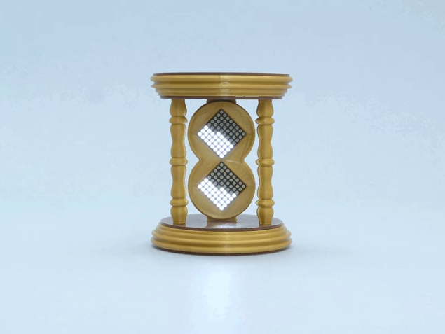
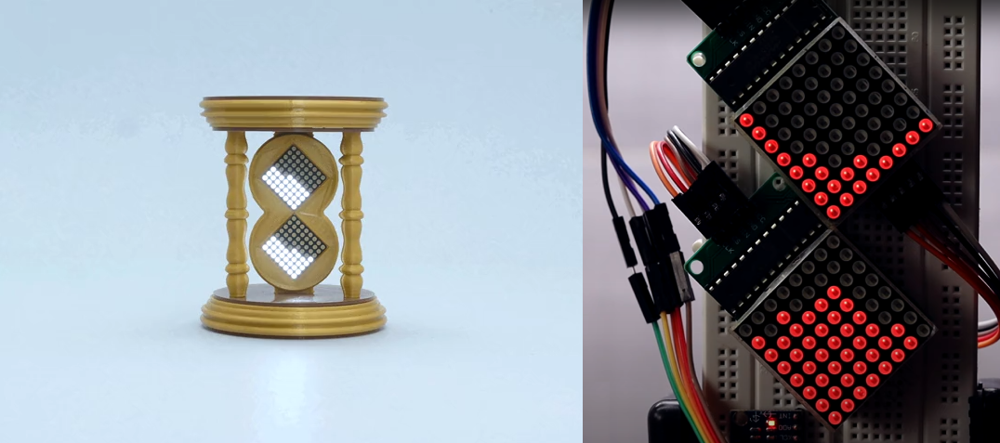
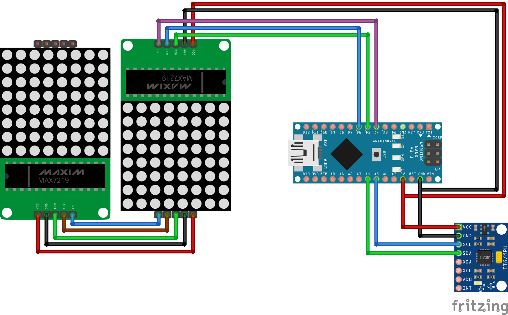
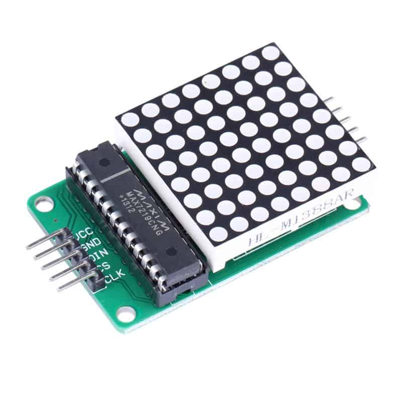
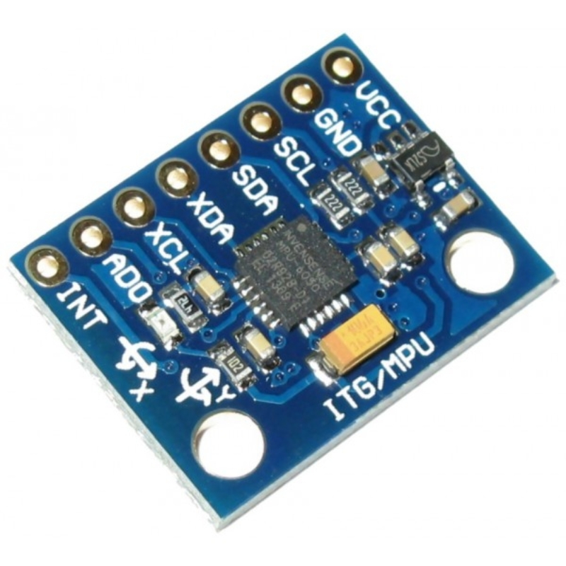
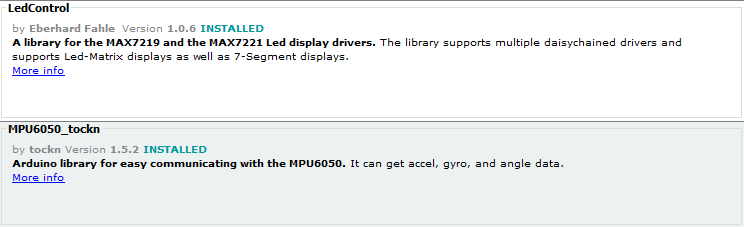

# ⌛ Hourglass
### Build an hourglass with arduino and gyroscope. Based on the [Viral Dodhia](https://www.viralsciencecreativity.com/post/arduino-hourglass-with-matrix-display-and-mpu6050) project. I have modified some lines of the original code so that the initial calculation is a little faster and the sand moves more fluidly.
# 🖖  

## 🗺️ Diagram

## 🧩 Components
<table style="width:100%">
  <tr>
    <td>
    🧠 Arduino nano
        
	</td>
    <td>
    🔴 MAX7219 (x2)
        
	</td>
    <td>
        🧭 MPU6050
        
	</td>
  </tr>
</table>

## 💿 Programs

## 📚 Libraries

⚠️ ` Copy the "Delay" folder into the arduino library directory. ` 
 
` 📁 Default -> C:\Users\{username}\Documents\Arduino\libraries `
 
✔️ ` Install the following libraries from arduino IDE. ` 

## 💾 Source

## ❓ Tutorials
⚠️ ` I add different variants to adjust it to your liking. The most complicated thing is to find a structure to put the components, I got it a wooden box. `

## 🧪 Testing

## 🔍 Samples

